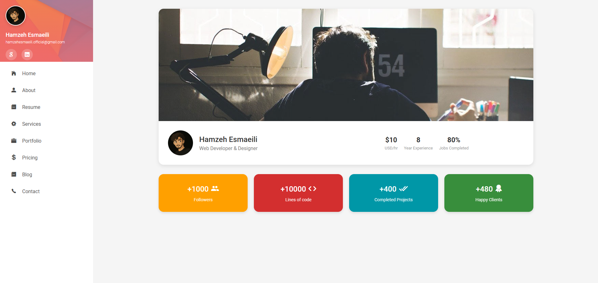

# Online Resume 



## 🚀 Introduction
A responsive online resume.

## ✨ Key Features
- ✅ Modern, professional design
- 📱 Fully responsive (with collapsible mobile menu)
- 🎨 Smooth CSS animations and transitions
- ♿ Accessibility optimized
- ⚡ Performance optimized

## 🛠 Technologies Used
- 
- 

## 🖥️ How to Run
1. Clone the repository:
```bash
git clone https://github.com/HamzehEsmaeili/resume-template.git
